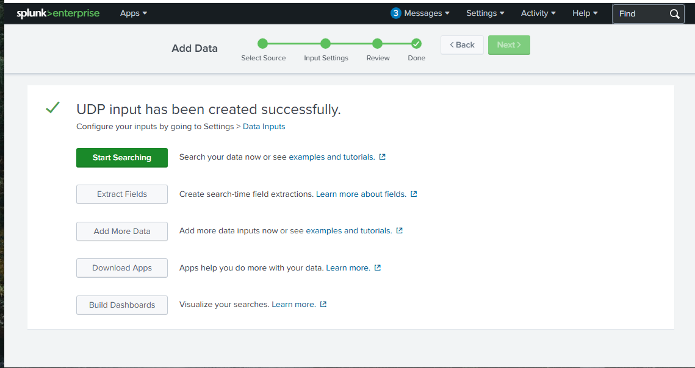
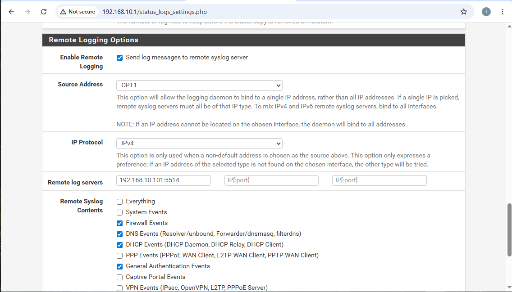
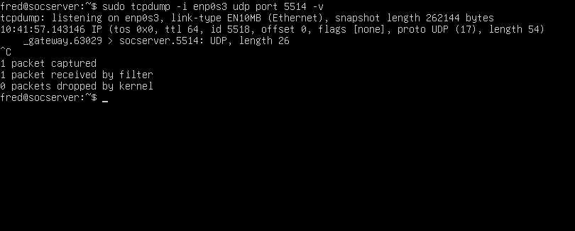
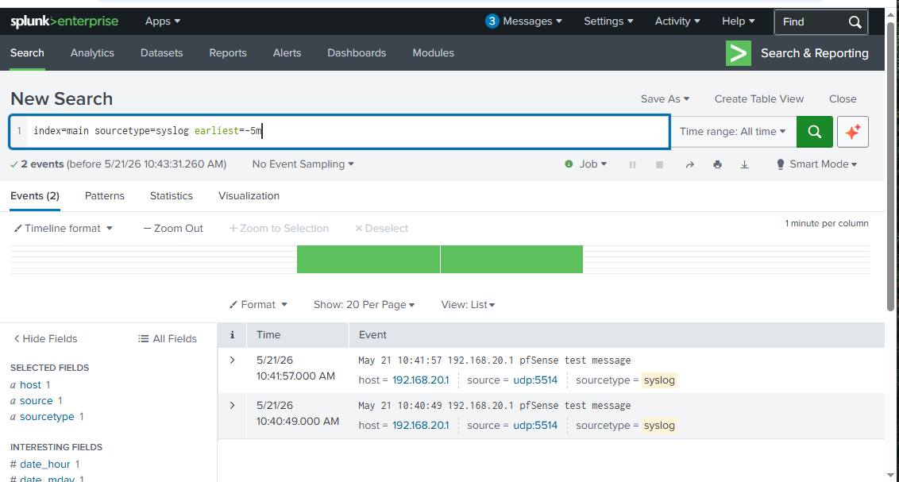

# pfSense Real-Time Log Forwarding to Splunk
## Configuring Syslog Pipeline from pfSense to Splunk SIEM

---

## 📌 Overview
This project configures pfSense to send real-time
firewall logs to Splunk SIEM using the syslog
protocol over UDP. This creates a live security
monitoring pipeline where firewall events are
immediately visible in Splunk for analysis and
threat detection.

---

## 🎯 Objectives
- Configure Splunk to receive syslog on UDP port 5514
- Enable remote logging on pfSense
- Verify log pipeline using tcpdump and Splunk search
- Confirm pfSense logs appear in Splunk in real time

---

## 🖥️ Environment
| Component | IP Address | Role |
|---|---|---|
| pfSense LAN | 192.168.10.1 | Firewall and router |
| pfSense OPT1 | 192.168.20.1 | Ubuntu server network |
| Ubuntu Server | 192.168.20.101 | Splunk SIEM host |
| Kali Linux | 192.168.10.102 | Attack platform |
| Windows VM | 192.168.10.100 | Management machine |

---

## Architecture

Log flow:
pfSense OPT1 → UDP port 5514 → Ubuntu Server → Splunk

pfSense generates firewall events and sends them
via syslog UDP to Splunk running on Ubuntu Server.
Splunk indexes and makes logs searchable in real time.

---

## Configuration Steps

### Step 1 — Configure Splunk UDP Input
Navigate to Settings → Data Inputs → UDP → Add New

Settings used:
- Port: 5514
- Source Type: syslog
- Index: main

Note: Port 514 was unavailable on Windows due to
OS restrictions on ports below 1024. Port 5514
was used as an alternative above the restricted range.

### Step 2 — Enable pfSense Remote Logging
Navigate to Status → System Logs → Settings

Remote Logging Options configured:
- Enable Remote Logging: checked
- Source Address: OPT1
- Remote Log Server: 192.168.20.101:5514
- Log Types: Firewall Events, DNS Events,
  DHCP Events, General Authentication Events

### Step 3 — Verify Network Connectivity
Confirmed pfSense OPT1 can reach Ubuntu:
ping from pfSense OPT1 to 192.168.20.101
Result: 3 packets transmitted, 0% packet loss

### Step 4 — Test Log Pipeline
Sent test message from pfSense command prompt:
echo pfSense test message | nc -u -w1 192.168.20.101 5514

Verified receipt on Ubuntu using tcpdump:
sudo tcpdump -i enp0s3 udp port 5514 -v
Result: gateway.63029 > socserver.5514 UDP confirmed

Verified in Splunk search:
index=main sourcetype=syslog earliest=-5m

---

## 📸 Results

### Splunk UDP Input Configured

### pfSense Remote Logging Settings

### Ubuntu tcpdump Confirming Traffic

### pfSense Logs in Splunk

---

## Analysis

### Finding 1 — UDP Port Restriction
Windows OS restricts ports below 1024 for
non-administrator processes. Port 514 (standard
syslog) was unavailable so port 5514 was used.
This is common in enterprise environments where
alternative syslog ports are standard practice.

### Finding 2 — Network Routing
pfSense has two internal interfaces:
- LAN: 192.168.10.1 — Kali and Windows network
- OPT1: 192.168.20.1 — Ubuntu server network

Syslog traffic must originate from OPT1 to reach
Ubuntu directly without routing complications.

### Finding 3 — Pipeline Verified
The complete log pipeline was verified:
pfSense → UDP 5514 → Ubuntu → Splunk

tcpdump confirmed packet arrival at Ubuntu and
Splunk search confirmed log indexing with correct
sourcetype syslog and host 192.168.20.1.

### Finding 4 — Real Time Monitoring
Logs appear in Splunk within seconds of being
generated — enabling real time threat detection
against pfSense firewall events.

---

## 🔐 Security Value

### What This Enables
With pfSense logs flowing into Splunk analysts can:
- Detect port scans in real time
- Monitor blocked connection attempts
- Track DHCP assignments for device inventory
- Correlate firewall blocks with other attack indicators
- Set up automated alerts for suspicious patterns

### Example Splunk Queries for pfSense Logs
Find all blocked traffic:
index=main sourcetype=syslog block

Find specific source IP:
index=main sourcetype=syslog 192.168.10.102

Find firewall events only:
index=main sourcetype=syslog filterlog

---

## 🔄 Next Steps
- Install Splunk Universal Forwarder on Ubuntu
  for more reliable log forwarding
- Configure real time Splunk alerts for blocked traffic
- Forward Windows VM logs to Splunk
- Build detection rules against live pfSense data

---

## 🔗 Related Projects
- [pfSense Firewall Configuration](https://github.com/Phredreeq/pfsense-firewall-configuration)
- [pfSense Firewall Deep Dive](https://github.com/Phredreeq/pfsense-firewall-deep-dive)
- [Firewall Log Analysis](https://github.com/Phredreeq/firewall-log-analysis)

---

## 👤 Author
Fredrick Agufenwa

Cybersecurity Student | SOC & Threat Detection
