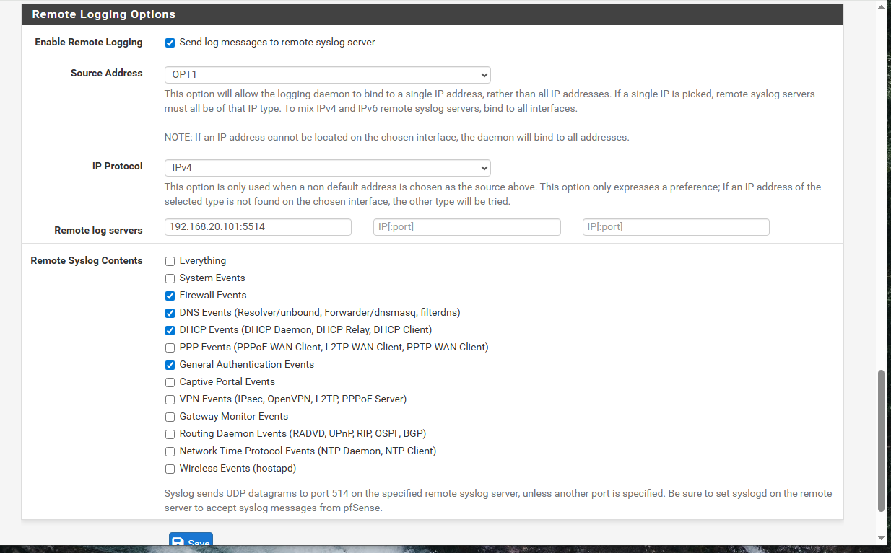
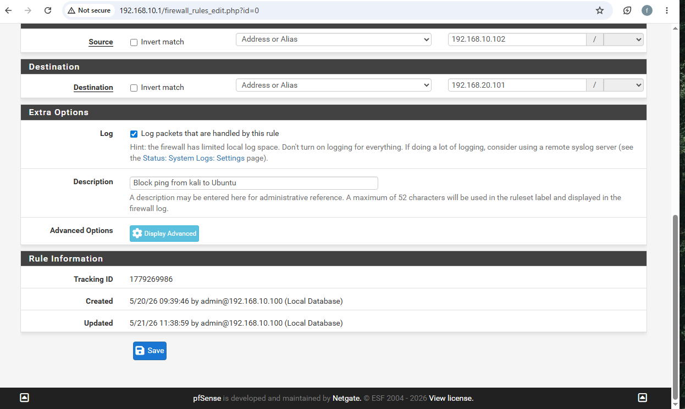
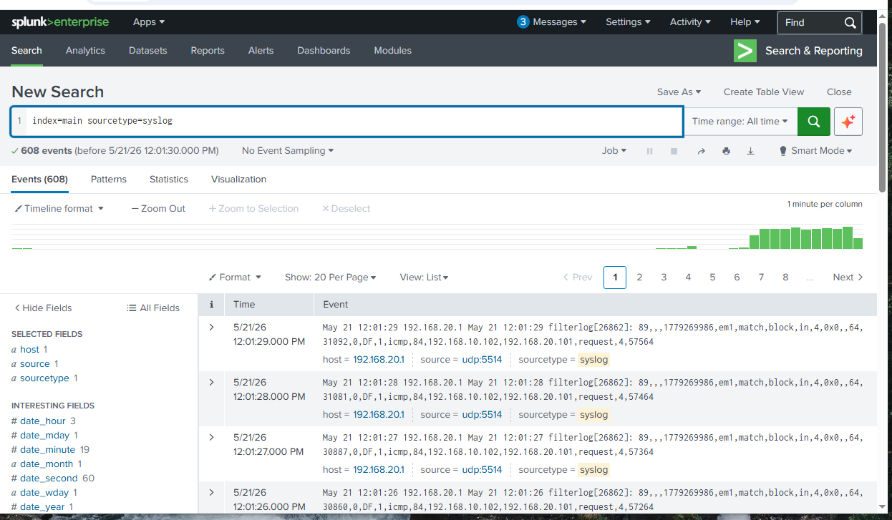
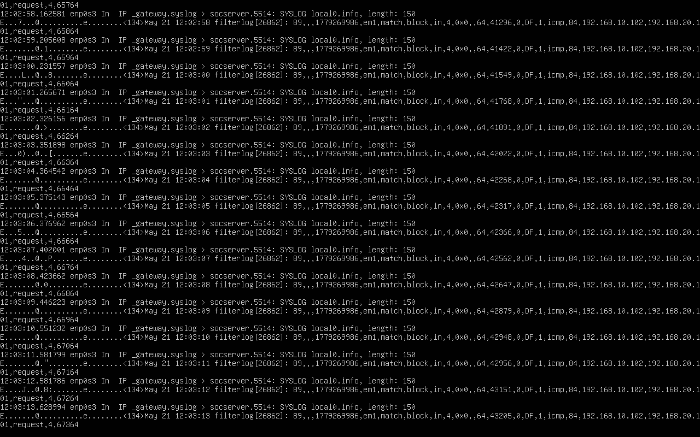

# pfSense Real-Time Log Forwarding to Splunk
## Building a Live Firewall Monitoring Pipeline

---

## Overview
This project configures pfSense to send real-time
firewall logs to Splunk SIEM using syslog over UDP.
The result is a live security monitoring pipeline
where every blocked connection, DNS query and DHCP
assignment appears in Splunk within seconds.

---

## Objectives
- Configure Splunk UDP listener for syslog on port 5514
- Enable pfSense remote logging to Splunk
- Enable firewall rule logging for blocked traffic
- Verify complete pipeline using tcpdump and Splunk
- Confirm real firewall events flowing in real time

---

## 🖥️ Homelab Environment
| Component | IP Address | Role |
|---|---|---|
| pfSense LAN | 192.168.10.1 | Firewall and router |
| pfSense OPT1 | 192.168.20.1 | Ubuntu server network gateway |
| Ubuntu Server | 192.168.20.101 | Splunk SIEM host |
| Kali Linux | 192.168.10.102 | Attack platform |
| Windows VM | 192.168.10.100 | Management machine |

---

## Architecture

Complete log pipeline:
Kali ping → pfSense blocks it → pfSense logs it
→ Syslog UDP → Ubuntu Server → Splunk indexes it
→ Searchable in real time

pfSense OPT1 (192.168.20.1) is directly connected
to Ubuntu Server (192.168.20.101) on the same
192.168.20.0/24 subnet — enabling direct syslog
delivery without routing complications.

---

## 🔧 Configuration Steps

### Step 1 — Configure Splunk UDP Input
Settings → Data Inputs → UDP → Add New

Port 514 was unavailable due to Windows OS
restrictions on ports below 1024. Port 5514
was used as the alternative.

Settings configured:
- Port: 5514
- Source Type: syslog
- Index: main

### Step 2 — Enable Firewall Rule Logging
Firewall → Rules → LAN → Edit block rule

Enabled the Log option on the SSH and ICMP
block rules so pfSense records every blocked
connection attempt in its firewall log.

Key setting enabled:
- Log packets that are handled by this rule: checked

### Step 3 — Configure pfSense Remote Logging
Status → System Logs → Settings → Remote Logging

Settings configured:
- Enable Remote Logging: checked
- Remote Log Server: 192.168.20.101:5514
- Firewall Events: checked
- DNS Events: checked
- DHCP Events: checked
- General Authentication Events: checked

### Step 4 — Troubleshooting

Issue 1 — Wrong IP address:
Initial configuration had 192.168.10.101:5514
instead of 192.168.20.101:5514
Fix — corrected IP to point to Ubuntu Server

Issue 2 — No logs appearing:
Firewall rule logging was not enabled
Fix — enabled Log option on block rules

After both fixes — logs immediately started
flowing into Splunk.

### Step 5 — Verification
Verified pipeline using tcpdump on Ubuntu:
sudo tcpdump -i enp0s3 udp port 5514 -v

Confirmed in Splunk:
index=main sourcetype=syslog

---

## Results

### pfSense Remote Logging Settings

### Firewall Rule with Logging Enabled

### Real pfSense Logs in Splunk — 608 Events

### Ubuntu tcpdump Confirming Syslog Stream

---

## Analysis

### Finding 1 — Real Firewall Events Confirmed
608 real pfSense firewall events were indexed
in Splunk. Each log entry contains:

filterlog[26862]: 89,,,1779269986,em1,
match,block,in,4,0x0,,64,31092,0,DF,1,
icmp,84,192.168.10.102,192.168.20.101,request

Breaking down the log:
- filterlog — pfSense packet filter log
- match,block,in — traffic matched and blocked
- icmp — protocol is ICMP ping
- 192.168.10.102 — source: Kali Linux
- 192.168.20.101 — destination: Ubuntu Server
- request — ping request was blocked

### Finding 2 — Real Time Detection Working
Logs appear in Splunk within 1 second of the
firewall event occurring. tcpdump on Ubuntu
confirmed continuous syslog stream:
_gateway.syslog > socserver.5514: SYSLOG

### Finding 3 — Troubleshooting Lessons
Two configuration errors were identified and
fixed independently:

Error 1 — Wrong subnet in remote log server IP
192.168.10.101 was typed instead of 192.168.20.101
This sent logs to wrong subnet — nothing arrived

Error 2 — Rule logging not enabled
pfSense only sends firewall logs for rules that
have logging explicitly enabled. Default rules
do not log — logging must be turned on per rule.

### Finding 4 — OPT1 Interface is Key
pfSense OPT1 (192.168.20.1) is on the same
subnet as Ubuntu (192.168.20.101). Syslog
traffic flows directly through OPT1 without
any routing complications.

---

## 🔐 Security Value

### What This Pipeline Enables
With real-time pfSense logs in Splunk:

Detection capabilities:
- Blocked port scans appear immediately
- Failed SSH attempts logged in real time
- ICMP reconnaissance attempts recorded
- DNS queries reveal what devices are doing
- DHCP assignments track device inventory

### Splunk Queries for pfSense Logs

All pfSense syslog events:
index=main sourcetype=syslog

Firewall block events only:
index=main sourcetype=syslog block

Traffic from specific IP:
index=main sourcetype=syslog 192.168.10.102

ICMP traffic blocked:
index=main sourcetype=syslog icmp

---

## ✅ Conclusion
Successfully built a complete real-time firewall
log monitoring pipeline from pfSense to Splunk.

608 real firewall events confirmed in Splunk
including blocked ICMP requests from Kali Linux
to Ubuntu Server. Every blocked connection now
appears in Splunk within seconds — enabling
real-time threat detection against live network traffic.

Key lessons:
- Enable logging on specific firewall rules
- Verify IP addresses carefully — subnet matters
- Use tcpdump to verify traffic at each hop
- OPT1 interface connects pfSense to Ubuntu subnet

---

## 🔗 Related Projects
- [pfSense Firewall Configuration](https://github.com/Phredreeq/pfsense-firewall-configuration)
- [pfSense Firewall Deep Dive](https://github.com/Phredreeq/pfsense-firewall-deep-dive)
- [Firewall Log Analysis](https://github.com/Phredreeq/firewall-log-analysis)

---

## 👤 Author
Fredrick Agufenwa

Cybersecurity Student | SOC & Threat Detection
